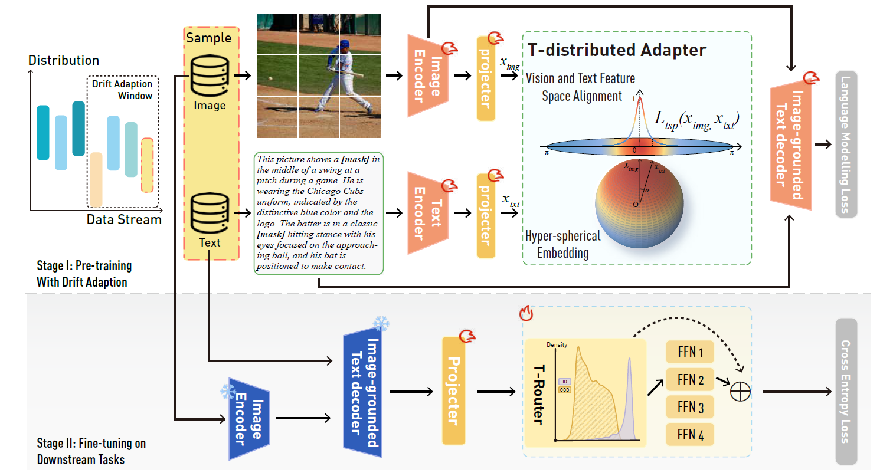

# Adapting Multi-Modality Large Language Model to Concept Drift in the Long-tailed Open World

This repository is a PyTorch implementation of concept drift aware vision language model in the long-tailed open world proposed in *Adapting Multi-Modality Large Language Model to Concept Drift in the Long-tailed Open World* (submitted)




Multi-modal Large Language Models (MLLMs) frequently face challenges from concept drift when dealing with real-world streaming data, wherein distributions change unpredictably. This mainly includes gradual drift due to long-tailed data and sudden drift from Out-Of-Distribution (OOD) data, both of which have increasingly drawn the attention of the research community. While these issues have been extensively studied in the individual domain of vision or language, their impacts on MLLMs in concept drift settings remain largely underexplored. In this paper, we reveal the susceptibility and vulnerability of Vision-Language (VL) models to significant biases arising from gradual drift and sudden drift, particularly in the pre-training. To effectively address these challenges, we propose a unified framework that extends concept drift theory to the multi-modal domain, enhancing the adaptability of the VL model to the distribution unpredictable changes. Additionally, a T-distribution based drift adapter is proposed to effectively mitigate the bias induced by the gradual drift, which also facilitates the model in distinguishing sudden distribution changes through explicit distribution modeling. Extensive experiments demonstrate our method enhances the efficiency and accuracy of image-text alignment in the pre-training of VL models, particularly in the concept drift scenario. Moreover, various downstream tasks exhibit significant improvements in our model's ability to adapt to the long-tailed open world. Furthermore, we create a set of multi-modal datasets called OpenMMlo, specifically tailored for the long-tailed open world settings, to validate our findings. To foster the development of the multi-modal community, we have made both OpenMMlo datasets and our code publicly available at: https://github.com/Anonymous0Knight/ConceptDriftMLLMs.


The code in this repo is copied/modified from [BLIP](https://github.com/salesforce/LAVIS).


## Installation

```bash
pip install -r requirements.txt
```

Meanwhile, you need to follow blip's guidelines to download the datasets. 


## OpenMMlo

We have upload our OpenMMlo datasets at [huggingface](https://huggingface.co/datasets/MiaoMiaoYang/OpenMMlo). You can also download them using below commandline:

```bash
# Make sure you have git-lfs installed (https://git-lfs.com)
git lfs install

git clone https://huggingface.co/datasets/MiaoMiaoYang/OpenMMlo

# If you want to clone without large files - just their pointers
GIT_LFS_SKIP_SMUDGE=1 git clone https://huggingface.co/datasets/MiaoMiaoYang/OpenMMlo
```


We extend the open-source datasets, namely ImageNet-LT [1], iNatualist2018 [2] and Places-LT [1]. ImageNet-LT has 1,000 classes and contains 115.8k samples, with a maximum of 1,280 samples and a minimum of 5 samples for a category. Besides, it consists of 18k images for OOD detection. 
Places-LT has 184.5K samples from 365 classes, with class samples ranging from 4,980 to 5. The iNaturalist 2018 is a large-scale species dataset collected in the natural world with 437.5K samples for 8,142 classes. We use the InstructBLIP[3] to generate the related caption of the image, with the prompt of *"What does this picture describe? Please describe in detail its size, location, color, and its relationship to the surroundings."*.
s
[1] Liu, Z., Z. Miao, X. Zhan, et al. Large-Scale Long-Tailed Recognition in an Open World. In Proceedings of the IEEE/CVF Conference on Computer Vision and Pattern Recognition, pages 2532–2541. IEEE, 2019

[2] Van Horn, G., O. Mac Aodha, Y. Song, et al. The INaturalist Species Classification and Detection Dataset. In Proceedings of the IEEE Conference on Computer Vision and Pattern Recognition, pages 8769–8778. 2018

[3] Dai, W., J. Li, D. Li, et al. InstructBLIP: Towards General-purpose Vision-Language Models with Instruction Tuning. Advances in Neural Information Processing Systems, 36:49250–49267,2023

